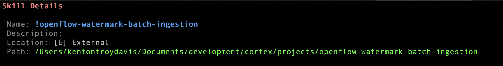

# coco-skill-batch-ingestion

We are developing a resuble AI Skill that can perform batch ingestions across a variety of source and destination types.
We also assert the fact that low latency, Change Data Capture is not always needed depending upon the requirements. This Skill captures changes
using various watermarking strategies via batch ingestion.
Interactively, CoCo can ask for the types to choose the right Processors, Service Controllers, and populate the Parameter Context.
Most importantly, CoCo uses the Skill to advise upon the best ingestion strategy based upon the user input.


% export PROJECT_HOME=/Users/kentontroydavis/Documents/development/cortex/projects

% cortex skill add ${PROJECT_HOME}/openflow-watermark-batch-ingestion
```
A new version (v0.26.113+005340.e3aef489) is available. Run 'cortex update' to upgrade.
Detected skills: openflow-watermark-batch-ingestion
Success: Added skill directory: /Users/kentontroydavis/Documents/development/cortex/projects/openflow-watermark-batch-ingestion
```

To see how the Skill was created using CoCo, go to [Batch Ingestion w. Watermarking](./development.md).



For an example of using the Skill in CoCo to build an Ingestion pipeline, using the following prompt
```
Please help me create an Openflow pipeline that performs change data capture via batch ingestion.
```

You can tell CoCo to create placeholders instead of specifying every parameter value. 
See example flow: [Output with Placeholders](./output/sqlserver-timestamp-cdc-flow.json)

For examples and an overivew on strategies, go to [Examples](./openflow-watermark-batch-ingestion/examples.md)


